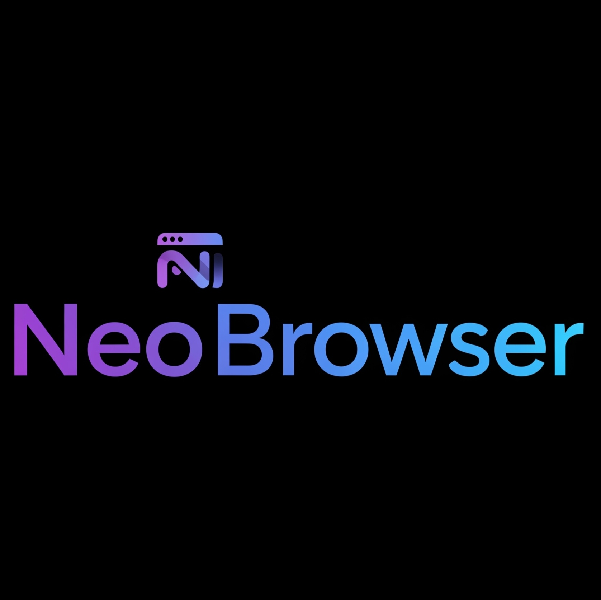

# 🌐 NeoBrowser


A **fully decentralized, privacy-first web browser** built on Electron. Lightweight, sandboxed, and leaves zero traces - no accounts, no browsing history, no trackers, and no ads.


[](https://opensource.org/licenses/MIT)


---

## ✨ Features

- 🔄 **Realtime Decentralization**  
  Automatically fetches the latest global server URL from a public JSON file. No hardcoded links - update the JSON and every user gets the new link instantly.

- 🔒 **Privacy by Default**  
  No accounts, no local storage of history/cookies/trackers, built-in `fetch://` protocol for sandboxed requests, and no ads or data collection (logging directory is temporary for testing purposes only).

- ⚡ **Zero Rebuilds**  
  Server updates propagate globally without app rebuilds thanks to our JSON key system.

- 🛠️ **Developer-Friendly**  
  Hot reload with `electronmon`, JSON-driven site mappings, and easy site management.

- 🖥️ **Lightweight & Cross-Platform**  
  Runs on Linux with minimal resource usage.

- 🪟 **Windows App Build Coming Soon**  
  .exe build for Windows in development.

---

## 📸 Demo

### 🔍 Home & Search 


### 🌐 Site Loading


### ⚙️ JSON Realtime Update


---

## 🚀 Installation & Usage

1. **Clone and install**
   ```bash
   git clone https://github.com/dwip-the-dev/neobrowser.git
   cd neobrowser
   npm install
   ```

2. **Run in development**
   ```bash
   npm start
   ```

3. **Build for production**
   ```bash
   npm run build
   ```

---

## 🔑 How It Works

NeoBrowser fetches the latest server configuration from a public JSON file:

```json
{
  "GLOBAL_SERVER_URL": "https://example-server.trycloudflare.com"
}
```

All requests automatically use this dynamically updated URL, ensuring you never hit dead servers.

The configuration can be found at: `https://neobrowser-backend.github.io/key/index.json`

---

## 🛠️ Development

**Hot reload** is enabled via electronmon. The browser will automatically restart on file changes.

**Adding sites** is done through JSON configuration in `registry.json`:

```json
"pricing.neo": {
  "name": "Pricing",
  "path": "sites/official/pricing/index.html"
}
```

**Protocols**:
- `fetch://` - Custom sandboxed fetch requests

---

## 📅 Roadmap

- [ ] Multi-tab support
- [ ] Windows app build
- [ ] Built-in extensions (adblock toggle, custom DNS)
- [ ] Encrypted P2P mode (serverless experimental)
- [ ] Mobile app builds (Android / iOS)
- [ ] Plugin marketplace

---

## ⚠️ Disclaimer

NeoBrowser is an **experimental project**. Do not use it for sensitive browsing unless you fully understand the privacy/security model. The logging directory is temporary and will be removed in future releases.

---

## 💡 Credits

Built with [Electron](https://www.electronjs.org/) and inspired by decentralized & privacy-first software like **Tails OS**.

---

## 🖤 Contributing

Contributions are welcome! Open an issue, submit a PR, or suggest features.

---

## 📜 License

MIT License © 2025 NeoBrowser Team

---

*This README is a living document that will evolve with the project. Check back regularly for updates!*
