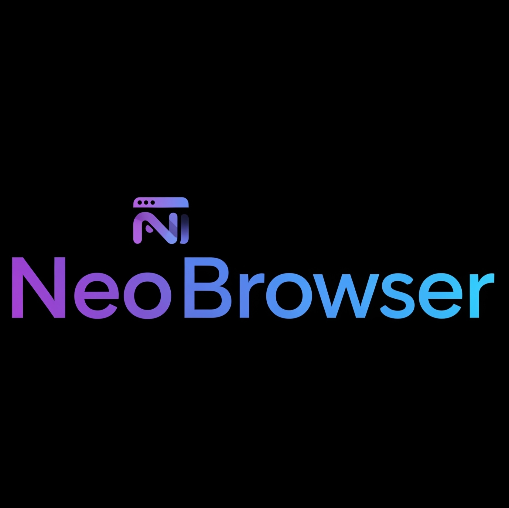

# 🌐 NeoBrowser


A **fully decentralized, privacy-first web browser** built on Electron. Lightweight, sandboxed, and leaves zero traces - no accounts, no browsing history, no trackers, and no ads.


[](https://opensource.org/licenses/MIT)


---

## ✨ Features

- 🔄 **Realtime Decentralization**  
  Automatically fetches the latest global server URL from a public JSON file. No hardcoded links - update the JSON and every user gets the new link instantly.

- 🔒 **Privacy by Default**  
  No accounts, no local storage of history/cookies/trackers, built-in `fetch://` protocol for sandboxed requests, and no ads or data collection (logging directory is temporary for testing purposes only).

- ⚡ **Zero Rebuilds**  
  Server updates propagate globally without app rebuilds thanks to our JSON key system.

- 🛠️ **Developer-Friendly**  
  Hot reload with `electronmon`, JSON-driven site mappings, and easy site management.

- 🖥️ **Lightweight & Cross-Platform**  
  Runs on Linux with minimal resource usage.

- 🪟 **Windows App Build Coming Soon**  
  .exe build for Windows in development.

---

## 📸 Demo

### 🔍 Home & Search 


### 🌐 Site Loading


### ⚙️ JSON Realtime Update


---

## 🚀 Installation & Usage

1. **Clone and install**
   ```bash
   git clone https://github.com/dwip-the-dev/neo-browser.git
   cd neo-browser
   npm install
   ```

2. **Run in development**
   ```bash
   npm start
   ```

3. **Build for production**
   ```bash
   npm run build
   ```

---

## 🔑 How It Works

NeoBrowser connects to the live serverless backend hosted on Vercel:

```json
{
  "GLOBAL_SERVER_URL": "https://neobrowser-bcknd.vercel.app"
}
```

All requests automatically route to this dynamically resolved endpoint, providing fast access to all 45 `.neo` decentralized sites.

---

## 🛠️ Development

**Hot reload** is enabled via `electronmon`. The browser will automatically reload on file changes.

**Adding sites** is done through JSON configuration in `registry.json`:

```json
"pricing.neo": {
  "name": "Pricing",
  "path": "sites/official/pricing/index.html"
}
```

**Protocols**:
- `fetch://` - Custom sandboxed fetch requests for .neo sites

---

## 📅 Roadmap

- [x] NeoSearch Google-style engine v2.0
- [x] 45 Decentralized sites 100% operational
- [x] 4-site randomized discovery grid
- [x] Vercel Serverless cloud backend
- [ ] Multi-tab support
- [ ] Windows app build
- [ ] Mobile builds (Android / iOS)

---

## 📬 Contact & Support

- **Developer**: Dwip Biswas ([@dwip-the-dev](https://github.com/dwip-the-dev))
- **Email**: [dwipbiswas@yahoo.com](mailto:dwipbiswas@yahoo.com)
- **Telegram**: [@dwip_thedev](https://t.me/dwip_thedev)
- **Live Server**: [neobrowser-bcknd.vercel.app](https://neobrowser-bcknd.vercel.app)

---

## 📜 License

MIT License © 2026 NeoBrowser (dwip-the-dev)
